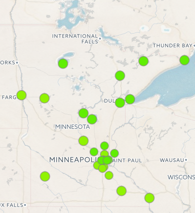
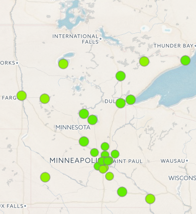

```{r echo = F, message=F, warning=F}
library(dplyr)
library(readr)

img_styles <- c("Bancroft (IA)"   = "margin-top: -55px;",
                "Boundary Waters" = "margin-top: 0px;",
                "Chanhassen"      = "margin-top: -34px;",
                "Chisago City"    = "margin-top: -34px;",
                "Duluth"          = "margin-top: -84px;",
                "Grand Portage"   = "margin-top: -15px;",
                "Grand Marais"    = "margin-top: -25px;",
                "Minneapolis"     = "margin-top: -45px;",
                "Mille Lacs"      = "margin-top: -45px;",
                "Plymouth"        = "margin-top: -70px;",
                "Preston"         = "margin-top: -35px;",
                "Shorewood"       = "margin-bottom: -25px;",
                "St Paul"         = "margin-top: -105px;",
                "Sioux City (IA)" = "margin-top: -55px;",
                "Truman"          = "margin-top: -35px;",
                "Waseca"          = "margin-top: -35px;")
 
print_slide <- function(img_class = "image", img_url, style = "margin-top: -15px;", city) {
  
  if(!is.null(city)) style <- img_styles[city][[1]]
  
  cat(paste0(c('<div class = "', img_class, '">',
             ' 0, paste0(' style = "', style, '"'), ""),
             '></div> \n\n'), collapse = ""))
}

print_caption <- function(class = "caption", label) {
  cat(paste0(c('<div class = "', class, '">', label, '</div> \n'), collapse = ""))
}

# Update Bloom Sky

#source("R/update_bloom_sky.R")

bloom_sites <- read.csv("data/Bloom Sky site list.csv", stringsAsFactors = F)

# Clean city name
bloom_sites$city <- gsub("[.]", "", bloom_sites$city)

# Site AQI max for 2017
site_max <- read_csv("X://Agency_Files//Outcomes//Risk_Eval_Air_Mod//_Air_Risk_Evaluation//Staff Folders//Dorian//AQI//Verification//AQI History//2017_site_max_aqi.csv")

print_max <- function(slide_num = 1, aqi_vals = 100) {
  
  x <- (slide_num - 1) * 6
  
  aqi_vals <- site_max$aqi_max[(x+1):(x+6)]
  
  colors   <- site_max$aqi_color[(x+1):(x+6)]
  
  cat(paste0(c('<div class = "day-slides">',
             '',
             '<div class = "max-aqi">', 
             '<div class ="max-title">Max AQI</div>',
             '<div>', 
             '<p style="color: ', colors[1], '">', aqi_vals[1], '</p>',
             '<p style="color: ', colors[2], '">', aqi_vals[2], '</p>',
             '<p style="color: ', colors[3], '">', aqi_vals[3], '</p>',
             '<p style="color: ', colors[4], '">', aqi_vals[4], '</p>',
             '<p style="color: ', colors[5], '">', aqi_vals[5], '</p>',
             '<p style="color: ', colors[6], '">', aqi_vals[6], '</p>',
             '</div>',
             '</div></div>'), 
             collapse = ""))
}
```

<script type="text/JavaScript">
  setTimeout(function() { window.location=window.location; }, 600000);
</script>  

<div class = "box left">
<div class = "inner">

<span class = "titles">NATIONAL 
</span><span class= "titles sub">Today&#39;s air quality 
</span>

<div class = "us-map">
<div style = "us-map-inner">           

</div>
</div>

</div></div>


<div class = "box left-low">
<div class = "inner">

<span class = "titles">MINNESOTA</span>
<span class = "titles sub">Visibility</span>

<div id = "haze-cams">

```{r haze-cams, echo = FALSE, results = 'asis'}

for(i in unique(bloom_sites$group)[]) {
  
  cat('<div class = "haze-slides">')
  
  images <- filter(bloom_sites, group == i)
  
  print_slide(img_url = images$bloom_img[1], city = images$city[1])
  print_slide(img_url = images$bloom_img[2], city = images$city[2])
  
  print_caption(label = images$city[1])
  print_caption(label = images$city[2])
  
  print_slide(img_url = images$bloom_img[3], city = images$city[3])
  print_slide(img_url = images$bloom_img[4], city = images$city[4])
  
  print_caption(label = images$city[3])
  print_caption(label = images$city[4])
  cat("</div>")
}
```

</div>
</div></div>


<div class = "box right">
<div class = "inner">
 

<span class = "titles">MINNESOTA</span>
<span class = "titles sub">Current air quality</span>

<div style = "height: 1%;"></div>
<div class = "mn-map"> 
<div class = "mn-map-inner"> 
<iframe class = "map" src="https://mpca.sonomatechdata.com/reportingarea/contourMap" frameborder="0" 
style="width: 98%; height: 95%; margin-left: -68px; margin-bottom: -85%;"></iframe>

</div></div>


<div class = "aqi-trends"> 

<div id = "city-titles">

<div><span class = "titles slides">
ROCHESTER</span><span class= "titles sub slides">Today&#39;s air quality</span>
</div>

<div><span class = "titles slides">
TWIN CITIES</span> <span class= "titles sub slides">
Today&#39;s air quality</span>
</div>

<div><span class = "titles slides">
DULUTH</span> <span class= "titles sub slides">
Today&#39;s air quality</span>
</div>

</div>


<div style="margin-left: 0; margin-top: 11%; margin-bottom: 0px;">
<p class= "titles sub" style="font-weight: bold;"> Ozone </p>

<div id = "o3-trends">

<div>

</div>

<div>

</div>

<div>

</div>

</div>
</div>


<div style ="margin-left: 0; margin-top: 24%; margin-bottom: 5px;">
<p class = "titles sub" style ="font-weight: bold;">PM2.5</p>

<div id = "pm-trends">
<div></div>
<div></div>
<div></div>
</div>
</div>

</div>

</div> </div>
            

<div class="box right-low">
<div class="inner">
            
<span class="titles">MINNESOTA</span>
<span class="titles sub">Air quality forecasts</span>

<div class = "forecast-map">
<span class= "titles sub" style="margin-left: 4px;"> 
`r weekdays(Sys.Date() + 1)` 
</span>

</div>

<div class = "forecast-map">
<span class= "titles sub" style="margin-left: 4px;"> 
`r weekdays(Sys.Date() + 2)` 
</span>

</div>


```{r aqi-history, echo=F}
```


<div class = "aqi-history"> 

<div><span class = "titles slides">
2017</span><span class= "titles sub">Count of AQI days by color</span>
</div>

<div id = "aqi-days" style="margin-top: 4%;>
```{r max_aqis, echo = FALSE, results = 'asis'}

for(i in 1:4) { print_max(i) }
```
</div>

</div>


</div></div>


<script src="js/trend_slides.js"> </script>
<script src="js/haze-cams.js"> </script>
<script src="js/aqi-days.js"> </script>